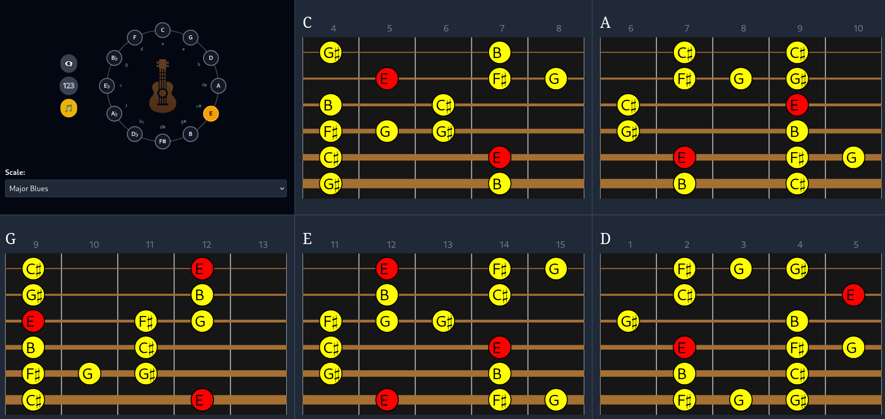

# GuitarCharts

GuitarCharts is a lightweight web application for visualizing guitar scales and chords with an emphasis on clarity, beauty, and ease of use.

- 🌟 Built using [Deno Fresh](https://fresh.deno.dev/)
- 🖊️ SVG-based fingering charts and Circle of Fifths
- 👀 Simple, intuitive interface
- 🔢 Focus on CAGED system and common scale modes



## Features

- Interactive **Circle of Fifths**
- Selectable **scale modes** (Major, Minor, Pentatonic, Blues, etc.)
- View all **CAGED positions** for any scale instantly
- **Root notes** clearly highlighted
- Option to **display intervals** or **note names**
- Designed for **guitarists learning theory and fretboard navigation**

## Current Scale Modes Supported

- Major Scale
- Natural Minor Scale
- Major Pentatonic Scale
- Minor Pentatonic Scale
- Major Blues Scale
- Minor Blues Scale

More to come!

## Getting Started

### Prerequisites
- [Deno](https://deno.land/) (v1.40+ recommended)

### Running Locally
```bash
git clone git@github.com:JaredCHall/GuitarCharts.git
cd GuitarCharts
deno task start
```
Open your browser to `http://localhost:8000`

### Building for Production
```bash
deno task build
```

## Project Structure

- `/islands` - Interactive components (CircleOfFifths, FingeringChart, etc.)
- `/classes` - Core TypeScript classes for scale logic and note finding
- `/routes` - Fresh routes and pages
- `/static` - Static assets (images, favicon)
- `/components` - Smaller UI components

## Philosophy

**GuitarCharts** was designed to feel like a musician's tool, not a math textbook. Minimalist, practical, and visually intuitive.

We believe that **understanding the fretboard visually** is the key to mastering guitar theory and improvisation.

## Roadmap

- ✅ 1.0 Release: Basic CAGED scale visualization for key modes
- ⏳ Future Releases:
    - Chord charts (Major, Minor, 7th, Extensions)
    - Custom user scales
    - Advanced scale mode library (e.g., Harmonic Minor, Melodic Minor)
    - Mobile-friendly optimizations
    - Save/share custom charts

## Contributing

Contributions are welcome! Feel free to fork the repository and submit a pull request.

---

Made with ❤️ for guitar players everywhere.
